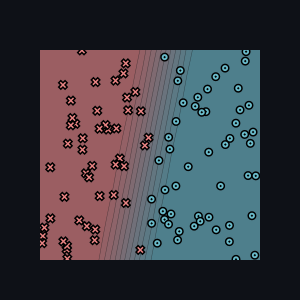
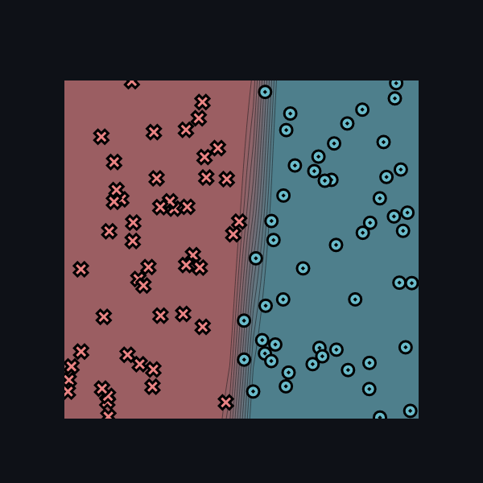

# MiniTorch Module 0

* Docs: https://minitorch.github.io/

* Overview: https://minitorch.github.io/module0.html

# Task 0.5

Для модели "Linear" и набора данных "Simple" были использованы параметры (-10,1.88,3.61):

Для модели "Network" и набора данных "Simple" были использованы параметры (4,0.1,625):

